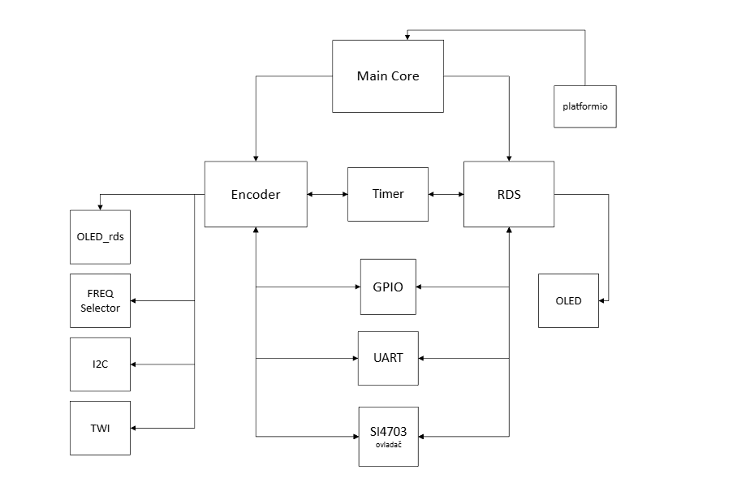

#  $\color{Aquamarine}{\textsf{🎶FM Radio – AVR Project}}$

Implementace FM rádia s podporou RDS, LCD a I2C komunikace.

  - Tento projekt realizuje plnohodnotné FM rádio na platformě AVR mikrokontrolérů. Jde o laboratorní úlohu z předmětu Digital Electronics 2, jejímž cílem je propojit více periferií mikrokontroléru a ukázat praktické řízení externích RF modulů.
  - Součástí projektu je vlastní implementace ovladače pro FM tuner (SI4703/TEA5767) přes sběrnici I²C, zobrazování a dekódování RDS informací, ovládání pomocí tlačítek a řízení uživatelského rozhraní.

---

## $\color{#75dad3}{\textsf{📌Popis projektu}}$

Projekt demonstruje:
- příjem FM signálu pomocí modulu SI4703 nebo TEA5767
- komunikaci s tunerem přes I²C (TWI)
- zobrazení informací na LCD/OLED displeji
- dekódování RDS (Radio Data System)
- ovládání rádia pomocí tlačítek/enkodéru
- přesné a automatické ladění frekvence
- měření síly signálu (RSSI)
- jednoduché uživatelské rozhraní

Kombinuje znalosti z oblastí:
- **I2C, GPIO, časovače, UART**
- C pro AVR (AVR-GCC)
- návrh embedded rozhraní
- práce s RF a audio signály

Thought Diagram of subroutines
 
---

## $\color{#75dad3}{\textsf{💻Hardware}}$

Mikrokontrolér: ATmega16/ATmega328

FM tuner:
- SI4703 (hlavní implementace, plná podpora RDS)
- LCD/OLED displej: 2×16 znaků / grafický OLED
- Ovládací prvky: tlačítka / rotační enkodér

Napájení: 5 V

Komunikační sběrnice: I²C

---

## $\color{#75dad3}{\textsf{⚙️Software}}$

$\color{#75dad3}{\textsf{
  - Jazyk: C
  - Kompilátor: AVR-GCC
  - Programování: AVRDUDE
- }}$

- Struktura projektu:
  - `main.c` – hlavní program
  - `SI4703` - ovladač pro FM tuner
  - `i2c.c/h` a `twi.c/h` – I2C komunikace a knihovny
  - `led.c/h`, `oled_rds.c/h` – zobrazení, ovládání LCD displeje a RDS
  - `cd.c/h` – LCD ovladač
  - `freq_selector.c/h` – volba frekvence
  - `uart.c/h` – ladicí výstup přes sériovou linku
  - `timer.c/h` – časovače

---

## $\color{#75dad3}{\textsf{Ovladač FM tuneru SI4703 – Dokumentace 📚}}$

Níže je shrnutí toho, co dělá kompletní software ovladače tuneru SI4703.

- Inicializace tuneru

- Tuner SI4703 se uvede do režimu I²C pomocí RESET linky.
  
- Následně se:

  - aktivuje krystal
  - aktivuje přijímač
  - načtou se a inicializují, všechny registry (0×00–0×0F)
  - provede se základní konfigurace audia a RDS

Čtení a zápis registrů
- Registery tuneru jsou zpracovány v poli si4703_regs[16].
  - si4703_readRegisters()
  → `načte všech 16 registrů tuneru.`
  - si4703_writeRegisters()
  → `zapíše registrační blok zpět (0×02–0×07).`

- Tím se realizuje kompletní obousměrná komunikace čipu.
---
### $\color{#75dad3}{\textsf{Ladění frekvence}}$

Funkce si4703_setChannel(freq):

- přepočítá frekvenci (kHz → kanál)
- nastaví bit TUNE
- čeká na dokončení STC (Seek/Tune Complete)
- vrátí přesně naladěnou frekvenci
- umožňuje přesné a opakovatelné ladění FM pásma
---

### $\color{#75dad3}{\textsf{Automatické ladění (SEEK)}}$

Pomocí si4703_seekUp() / seekDown():
   
   - tuner vyhledává další dostupnou stanici a zastaví se na prvním dostatečně silném signálu
   - vrací buď nalezenou frekvenci, nebo informaci o neúspěchu
---
### $\color{#75dad3}{\textsf{Hlasitost Síla signálu – RSSI}}$

- Hlasitost je řízena pomocí bitů registru 0×05:
  
  - rozsah `0–15`
  - funkce: `si4703_setVolume()`, `si4703_getVolume()`
---
### $\color{#75dad3}{\textsf{Síla signálu – RSSI}}$

- Funkce si4703_getRSSI() čte aktuální kvalitu signálu (0–75).
- Slouží pro indikaci, zda je naladěná stanice stabilní.
---
### $\color{#75dad3}{\textsf{Dekódování vysílaných textů}}$

- Funkce si4703_readRDS() podporuje:

  - PS (Program Service) – název stanice `(8 znaků)`
  - RadioText – textové zprávy `(až 64 znaků)`
  - Zpracovává RDS bloky typu 0A/0B a 2A a ukládá texty pro zobrazení.
---
## $\color{#75dad3}{\textsf{Rozdělení práce}}$

- Rous - `implementace RDS, dekódování textu`

- Smetana - `enkodér, ovládací prvky`

- Pochylý - `LCD a zobrazení informací`

- Maděránek - `plakát (GitHub), schémata, propojení v main.c`

---

## $\color{#75dad3}{\textsf{Shrnutí}}$

Projekt představuje kompletní implementaci FM rádia na AVR, zahrnující:

  - Ovladač FM tuneru SI4703 přes I²C
  - Automatické ladění, nastavení hlasitosti a měření signálu
  - Zobrazení informací na LCD/OLED
  - Podporu RDS (název stanice & text)
  - Ovládání pomocí tlačítek nebo enkodéru
  - Modulární strukturu zdrojového kódu

